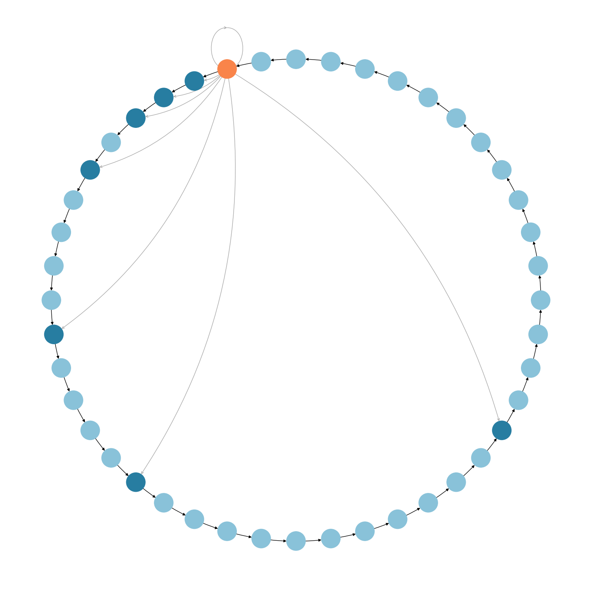

# kademlia
Assignment for the course on **Distributed Systems 2** and **Simulation and Performance Evaluation**.

The goal of this assignment is to implement the Kademlia protocol in Python and simulate its behaviour to later conduct a performance evaluation analysis. In order to have a protocol to which compare Kademlia to, we also implement the Chord DHT.

For the course on Distributed Systems 2 we implemented the simulator for the Kademlia protocol and for the Chord protocol, along with some basic performance evaluation. 

For the course on Simulation and Performance Evaluation we refactored the whole simulator in order to have **more control and granularity** on the creation of events for message handling. We also enhanced the Chord protocol in order to make it as robust as the Kademlia protocol in case of node failures by giving **each node a set of _K_ identities**. Then, we introduced nodes **joining and crashing during the simulation** in order for Chord to be forced to implement **periodic finger table updates** to make the comparison between the protocols fair.

# Installation
* Clone this repository: 
    ```[bash]
    git clone git@github.com:GiovanniZotta/kademlia.git
    ```
* [Optional] Create a virtual environment:
    ```[bash]
    python3 -m venv path-to-venv
    source path-to-venv/bin/activate
    ```
* Install the package in edit mode:
    ```[bash]
    pip install -e "kademlia[test]"
    ```
* Check that all the tests are working:
    ```[bash]
    pytest
    ```
* Try it out! To run a simulation for both DHTs you can use the following command:
    ```[bash]
    make plots NODES=100 TIME=1000 RATE=0.1
    ```
* The plots will end up in res/plots. The Makefile offers various commands such as:
    ```[bash]
    make plots
    make plot_network
    make plot_arrival_rate
    ```

# Plots
Our simulator offers the possibility to make a chart of the DHT from the perspective of a node.



