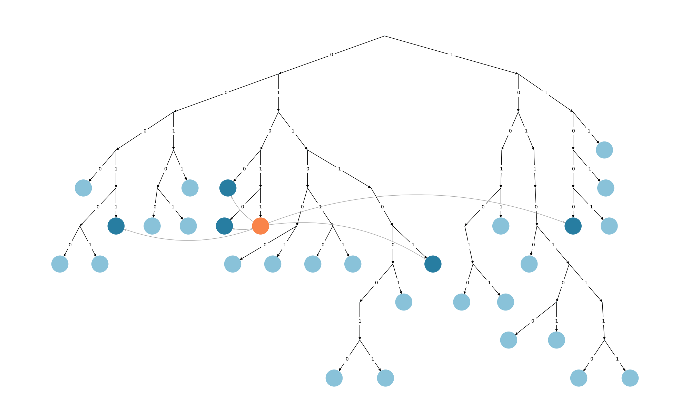
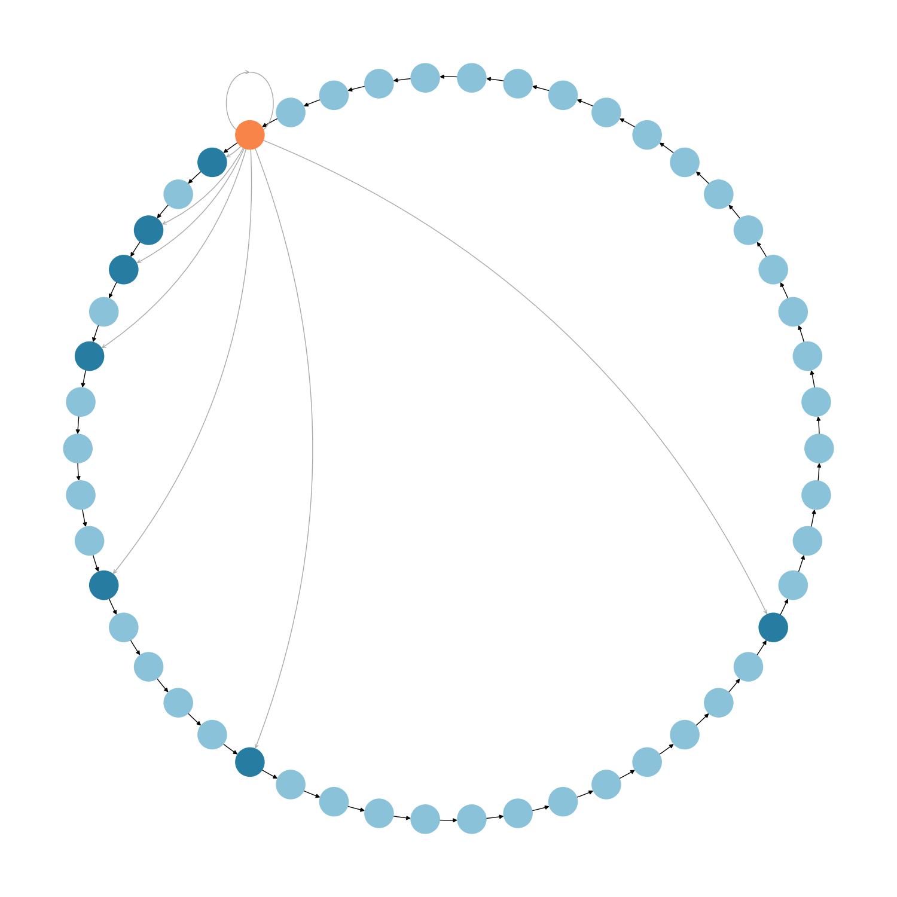

# kademlia
Assignment for the course on Distributed Systems 2.

The goal of this assignment is to implement the Kademlia protocol in Python and simulate its behaviour to later perform a performance evaluation analysis. In order to have a protocol to which compare Kademlia to, we also implement the Chord DHT.

# Installation
* Clone this repository: 
    ```[bash]
    git clone git@github.com:GiovanniZotta/kademlia.git
    ```

* [Optional] Create a virtual environment:
    ```[bash]
    python3 -m venv path-to-venv
    source path-to-venv/bin/activate
    ```
* Install the package in edit mode:
    ```[bash]
    pip install -e kademlia
    ```

* Try it out:
    ```[bash]
    python main.py
    ```

# Plots




